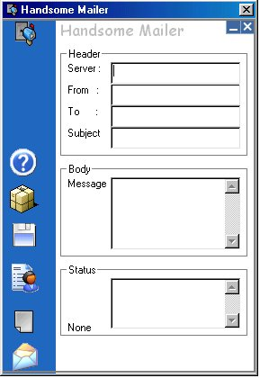

## Handsome Mailer

### Description

Clearly demostrates how to send email using smtp and also uses the UUEncode algorithum to encode files to be sent as attachments. One more thing: This program has GREAT GUI!!!

If you press the "Send" button fast enough, it can also act as an EMAIL SPAMMER!!!

----

Must-See

----

 
### More Info
 

             |
---                |---
**Submitted On**   |2001-09-02 00:34:04
**By**             |[su\_su\_u](https://github.com/Planet-Source-Code/PSCIndex/blob/master/ByAuthor/su-su-u.md)
**Level**          |Intermediate
**User Rating**    |4.5 (18 globes from 4 users)
**Compatibility**  |VB 5\.0, VB 6\.0
**Category**       |[Miscellaneous](https://github.com/Planet-Source-Code/PSCIndex/blob/master/ByCategory/miscellaneous__1-1.md)
**World**          |[Visual Basic](https://github.com/Planet-Source-Code/PSCIndex/blob/master/ByWorld/visual-basic.md)
**Archive File**   |[Handsome M25722912001\.zip](https://github.com/Planet-Source-Code/su-su-u-handsome-mailer__1-26866/archive/master.zip)

